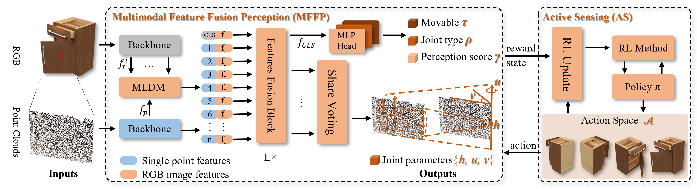

# MARS: Multimodal Active Robotic Sensing for Articulated Characterization, [IJCAI 2024]

In this work, we introduce MARS, a novel framework for articulated object characterization. It features a multi-modal fusion module utilizing multi-scale RGB features to enhance point cloud features, coupled with reinforcement learning-based active sensing for autonomous optimization of observation viewpoints. In experiments conducted with various articulated object instances from the PartNet-Mobility dataset, our method outperformed current state-of-the-art methods in joint parameter estimation accuracy. Additionally, through active sensing, MARS further reduces errors, demonstrating enhanced efficiency in handling suboptimal viewpoints.

<div  align="center">    
 
</div>

## Installation
PyTorch >= 1.7.0 < 1.11.0; python >= 3.7; CUDA >= 9.0; GCC >= 4.9; torchvision;
```
pip install -r requirements.txt
```
```
# PointNet++
pip install "git+https://github.com/erikwijmans/Pointnet2_PyTorch.git#egg=pointnet2_ops&subdirectory=pointnet2_ops_lib"
```
## Training
The PartNet-Mobility dataset was downloaded from [here](https://sapien.ucsd.edu/downloads) and imported into the SAPIEN simulation environment to extract labels.
```
CUDA_VISIBLE_DEVICES=<GPU> python main.py --config cfgs/train.yaml --exp_name <output_file_name>
```
## Reference

